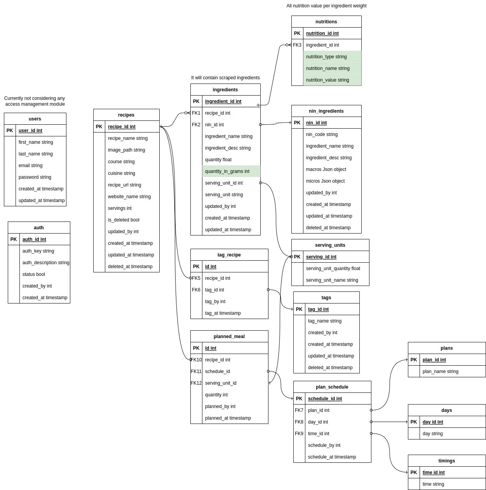

# Food DB APIs


## Getting started

Flask API for meal management and recipe management.

---
#### The main components of Food DB tech stack are:

  - **Flask** flask api and store data in Postgres.
  - **SQL Alchemy** - Python SQL toolkit and Object Relational Mapper
  - **PostgreSQL** - database for food db

---

### Tools

- Flask - https://flask.palletsprojects.com/en/1.1.x/
 - Postgres - https://www.postgresql.org/
---  

#### Database Architecture

Edit diagram here: https://drive.google.com/file/d/1caNbffsqkHGGq422AAh7hidWJUZFdmVT/view?usp=sharing
---

### Directory Structure
- **app.py** - main entry point of the API
- **extensions.py** - for initializing all the extensions of projects (e.g. marshmallow, migration, seeders)
- **env.example** - for all environment variables
 - **requirements.txt** - for all dependencies 
 - **Dockerfile** - For creating docker container of the project (assume our api runs on port 5000)
 - **docker-compose.yml** - composer file for container along with passing environment
 - **jenkinsfile** - jenkins command to run build and start docker container on server
 - **api_v1** - all the API core logic
    - **user_management.py** - for users management CRUD operations
    - **api_v1_app.py** - for api key management
    - **recipe_management.py** - for recipe management APIs CRUD Operations
     - **plan_management.py** - for plan management and meal mapping to plan and other APIs CRUD Operations
     - **nin_management.py** - for NIN data CRUD operations
- **models** - will contain all the models for database tables
- **schemas** - this directory will contain all the marshmallow schemas for serializing and deserializing data
- **seeds** - this directory will contain all the seeders like serving units, NIN etc.

### Installation

Food DB API  requires [Python](https://www.python.org/downloads/release/python-380/) 3.8 to run.

Installation has 2 main parts.
-  Setting up docker for **Postgres** (optional if you want postgress locally or you can setup postgres without docker)
- Configuring the **Environment**

#### Docker-Postgres
* install postgres
    ```sh
    $ docker run \
	 --name postgres-db \
	 -e POSTGRES_PASSWORD={postgres password} \
	 -e POSTGRES_USER=postgres \
	 -e POSTGRES_DB={postgres database} \
	 -e PGDATA=/var/lib/postgresql/data/pgdata \
	 -v psql-data:/var/lib/postgresql/data \
	 -p 5432:5432 \
	 -d \
	 postgres
    ```


* See the working Docker containers.
    ```sh
    $ docker ps
    ```

* Start docker containers.
    ```sh
    $ docker start postgres-db
    ```

####  configuring the Environment
* Create and switch virtual env using following commands(install miniconda if not installed from https://conda.io/projects/conda/en/latest/user-guide/install/index.html).

    ```sh
    $ conda create --fooddb
    $ conda activate fooddb
    ```
* Install required libraries.
    ```sh
    $ pip install -r requirements.txt
    ```
* Set environment variables in .envfile
* Create database using migration
    * init migration
        ```sh
        $ flask db init -d "migration-local"
        ```
    * start migration
        ```sh
        $ flask db migrate -d "migartion-local"
    * update database
        ```sh
        $ flask db upgrade -d "migration-local"
        ```
* Seed database with NIN data, Plans and serving units
    ```sh
    flask seed run
    ```
* To check db connection and installed libraries run code using

    ```sh
    $ python wsgi.py
    ```

### Usage
To run api locally start food db API with command
```sh
$ python wsgi.py
```
or using docker 
```sh
$ docker compose up
```

### Deployment
To deploy API on fresh server install docker on server clone git repo and run following command

```sh
$ docker compose build
$ docker compose up -d 
```
for current dev server jenkins CI/CD pipeline is already setup.
merging any branch to dev branch will deploy changes to the server
 